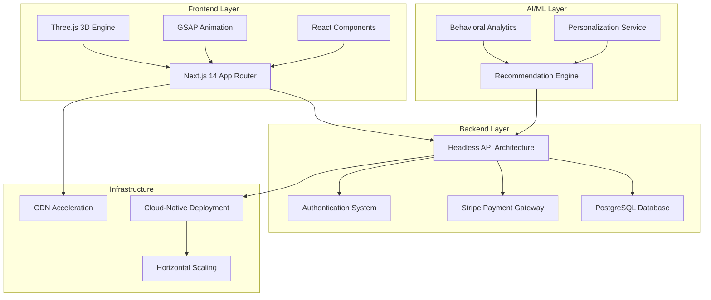

# Starry Night Premium Art Marketplace
## Investor-Ready Technical & Strategic Whitepaper

**Version 1.0** | February 2026

---

## Executive Summary

### Mission Statement

Starry Night is building the world's most immersive digital art marketplace, blending cinematic technology, AI-powered personalization, curated artist governance, and luxury brand positioning to transform how collectors discover and acquire premium art online.

### Vision

Transform online art commerce from transactional browsing into an experiential, emotionally resonant digital gallery that rivals the intimacy and prestige of physical art spaces.

### Market Positioning

**Premium curated art marketplace with immersive 3D storytelling**

We occupy the intersection of three powerful trends:
- **Digital transformation** of luxury commerce
- **Experiential web technology** (3D, AI, cinematic UX)
- **Creator economy** empowerment

---

## The Problem: A Broken Art Marketplace Landscape

The online art market suffers from five critical failures:

### 1. **Generic, Non-Immersive Experiences**
Current platforms treat art like commodity products—grid layouts, minimal context, zero emotional engagement. Art deserves better.

### 2. **Oversaturation Without Curation**
Open marketplaces prioritize volume over quality, drowning exceptional artists in noise and devaluing the entire ecosystem.

### 3. **Poor Artist Monetization**
Exploitative commission structures (40-50%), lack of pricing control, and race-to-the-bottom discount culture harm artist sustainability.

### 4. **Zero Personalization**
Collectors face overwhelming choice paralysis with no intelligent guidance, leading to decision fatigue and abandoned sessions.

### 5. **Weak Brand Storytelling**
Platforms lack identity, aesthetic coherence, and emotional resonance—critical factors in luxury purchasing decisions.

> [!IMPORTANT]
> **Market Gap**: No platform combines premium curation, immersive technology, and artist-first economics in a cohesive luxury brand.

---

## Our Solution: The Starry Night Difference

### Core Differentiators

#### 🎬 **Cinematic 3D Browsing Experience**
- Three.js-powered immersive galleries
- GSAP scroll-driven storytelling
- Painterly starfield atmospherics
- Premium visual design language

#### 🤖 **AI-Powered Personalized Curation**
- Hybrid recommendation engine (collaborative + content-based)
- Behavioral learning from browsing patterns
- Style preference mapping
- Engagement-optimized discovery

#### 🎨 **Limited Edition Authenticity System**
- Blockchain-ready provenance tracking
- Serial number governance
- Scarcity enforcement
- Certificate of authenticity

#### ✨ **Curated Artist Onboarding**
- Invite-only application process
- Portfolio quality standards
- Brand alignment screening
- Sustainable artist community

#### 💎 **Premium Brand Positioning**
- "Digital Renaissance Gallery" identity
- Elegant, artistic, cinematic tone
- Anti-discount, anti-mass-market
- Luxury collector focus

---

## Market Opportunity

### Global Art Market Size

The global art market is a **multi-billion USD industry** with accelerating digital adoption:

- **Online art sales growth**: 15-20% CAGR (2023-2028)
- **Millennial/Gen-Z collectors**: 40% of new buyers (digitally native)
- **Premium segment resilience**: High-value art ($10K+) shows strongest online growth

### Target Customer Segments

#### Primary Segments
1. **Emerging Collectors** (25-40 years old)
   - First-time art buyers seeking guidance
   - Budget: $500-$5,000 per piece
   - Value: Curation, education, authenticity

2. **Premium Digital Buyers**
   - Established collectors expanding online
   - Budget: $5,000-$50,000 per piece
   - Value: Exclusivity, provenance, convenience

3. **Art Enthusiasts**
   - Frequent browsers, occasional buyers
   - Budget: $200-$2,000 per piece
   - Value: Discovery, storytelling, community

4. **Young Affluent Professionals**
   - Tech/finance professionals
   - Budget: $1,000-$10,000 per piece
   - Value: Investment potential, status, aesthetics

### Geographic Focus

**Phase 1** (Year 1-2): Urban premium markets
- New York, Los Angeles, San Francisco
- London, Paris, Berlin
- Singapore, Hong Kong, Tokyo

**Phase 2** (Year 3+): Global expansion
- Secondary cities in North America, Europe, Asia
- Emerging markets with growing collector bases

---

## Product Architecture

### Technology Stack Overview

### Frontend Architecture

**Next.js 14 + React 18**
- Server-side rendering for SEO
- App Router for optimal performance
- TypeScript for type safety

**Three.js Cinematic Rendering**
- Custom shaders for painterly effects
- Particle systems for atmospheric depth
- Camera orchestration tied to scroll

**GSAP Scroll Storytelling**
- Lenis smooth scroll integration
- Timeline-based narrative sections
- Performance-optimized animations

### Backend Architecture

**Headless API Design**
- RESTful endpoints
- Modular service architecture
- Microservices-ready structure

**PostgreSQL Database**
- Relational data modeling
- ACID compliance for transactions
- Scalable query optimization

**Stripe Payment Integration**
- Secure payment processing
- Multi-currency support
- Subscription-ready infrastructure

### AI/ML Layer

**Hybrid Recommendation Engine**
- **Collaborative filtering**: User similarity patterns
- **Content-based filtering**: Artwork attribute matching
- **Behavioral signals**: Time-on-page, scroll depth, favorites

**Personalization Service**
- Real-time preference learning
- Style taxonomy mapping
- Engagement prediction models

**Analytics Pipeline**
- User journey tracking
- Conversion funnel analysis
- Artist performance metrics

### Infrastructure

**Cloud-Native Deployment**
- Containerized services (Docker-ready)
- Auto-scaling capabilities
- Multi-region deployment support

**CDN Acceleration**
- Global edge caching
- Image optimization
- Video streaming support

**Performance Targets**
- Page load: <2 seconds
- Time to interactive: <3 seconds
- Lighthouse score: >90

---

## Competitive Landscape

### Direct Competitors

| Platform | Positioning | Weaknesses |
|----------|-------------|------------|
| **Saatchi Art** | Open marketplace | Low curation, generic UX, discount culture |
| **Artsy** | Gallery aggregator | Complex navigation, inconsistent quality |
| **1stDibs** | Luxury focus | Traditional UX, limited digital-native art |
| **SuperRare** | NFT platform | Crypto barrier, speculative perception |

### Competitive Weaknesses We Exploit

1. **Low Curation**: Open platforms sacrifice quality for volume
2. **Poor UX**: Legacy interfaces lack immersion and storytelling
3. **No Personalization**: Static browsing with no intelligent guidance
4. **Discount Tactics**: Race-to-the-bottom pricing erodes brand value
5. **Weak Artist Support**: High commissions, poor monetization tools

### Our Strategic Moat

#### 1. **Strong Brand Aesthetic**
Cohesive visual identity creates emotional connection and brand recall—difficult to replicate.

#### 2. **Curated Artist Network**
Invite-only model builds exclusive community and quality perception—network effects strengthen over time.

#### 3. **Proprietary Immersive Frontend**
Custom Three.js + GSAP implementation creates unique user experience—high technical barrier to entry.

#### 4. **AI Personalization Engine**
Behavioral data compounds over time—first-mover advantage in recommendation quality.

#### 5. **Limited Edition Governance**
Authenticity and scarcity systems build trust—critical for premium positioning.

> [!NOTE]
> **Defensibility**: Our moat deepens with scale—more artists attract more collectors, more data improves AI, stronger brand enables premium pricing.

---

## Revenue Model

### Primary Revenue Stream

**Commission on Artwork Sales: 20-25%**

- Industry-competitive (vs. 40-50% at traditional galleries)
- Transparent pricing builds artist trust
- Scales with transaction volume

**Example Unit Economics:**
- Average artwork price: $2,000
- Platform commission (22.5%): $450
- Artist receives: $1,550
- Payment processing (2.9% + $0.30): ~$60
- **Net revenue per sale: ~$390**

### Secondary Revenue Streams

#### 1. **Featured Placement Fees**
- Homepage feature: $500-$1,500/week
- Category spotlight: $200-$500/week
- Newsletter inclusion: $300-$800/edition

#### 2. **Premium Artist Subscription**
- Enhanced analytics dashboard
- Priority support
- Marketing tools access
- **Pricing**: $49-$99/month

#### 3. **Limited Edition Launch Fees**
- Exclusive drop promotion
- Collector waitlist management
- Launch event coordination
- **Pricing**: $1,000-$5,000 per launch

### Future Revenue Opportunities

#### 1. **NFT Integration**
- Blockchain authentication layer
- Digital + physical hybrid sales
- Royalty tracking on secondary sales

#### 2. **Auction Model**
- Timed auctions for premium works
- Buyer's premium (10-15%)
- Exclusive collector events

#### 3. **Collector Subscription Tier**
- Early access to new releases
- Personalized curation service
- Virtual exhibition invitations
- **Pricing**: $29-$99/month

---

## Unit Economics

### Revenue Per Transaction

**Average Transaction Value (ATV)**: $2,000
**Platform Commission**: 22.5%
**Gross Revenue Per Sale**: $450
**Payment Processing Costs**: $60
**Net Revenue Per Sale**: $390

### Customer Acquisition Cost (CAC)

**Optimized Through Brand Positioning**

- **Organic channels**: SEO, content marketing, artist referrals
- **Paid channels**: Instagram, Pinterest, Google Display
- **Target CAC**: $50-$150 per collector
- **Payback period**: 1-2 transactions

### Lifetime Value (LTV)

**Increases with Repeat Collectors**

- **Average purchases per year**: 2-3
- **Average customer lifespan**: 3-5 years
- **LTV calculation**: 2.5 purchases/year × $390 net revenue × 4 years = **$3,900**
- **LTV:CAC ratio**: 26:1 to 78:1 (healthy threshold: >3:1)

> [!TIP]
> **Economic Leverage**: High LTV:CAC ratio enables aggressive growth investment while maintaining profitability path.

---

## Growth Strategy

### Phase 1: Curated Launch (Year 1)

**Objective**: Establish brand credibility and artist network

**Tactics**:
- Invite-only artist onboarding (50-100 artists)
- Limited curated collection (500-1,000 artworks)
- Soft launch to beta collectors
- Press outreach to art/tech publications
- Influencer seeding (micro-influencers in art space)

**Metrics**:
- 100 artists onboarded
- 1,000 artworks listed
- 5,000 registered collectors
- $500K GMV (Gross Merchandise Value)

### Phase 2: Regional Scaling (Year 2)

**Objective**: Expand artist base and geographic reach

**Tactics**:
- Influencer collaborations (established art collectors)
- Digital exhibitions (themed collections)
- Editorial storytelling campaigns (artist spotlights)
- Paid acquisition (Instagram, Pinterest)
- Gallery partnerships (hybrid digital/physical)

**Metrics**:
- 500 artists onboarded
- 5,000 artworks listed
- 25,000 registered collectors
- $3M GMV

### Phase 3: Global Expansion (Year 3+)

**Objective**: Achieve market leadership and profitability

**Tactics**:
- Global artist expansion (international markets)
- Premium collector membership program
- Auction functionality launch
- NFT integration
- Strategic partnerships (luxury brands, museums)

**Metrics**:
- 2,000+ artists onboarded
- 20,000+ artworks listed
- 100,000+ registered collectors
- $15M+ GMV
- Path to profitability

---

## Brand Positioning

### Brand Identity

**"Digital Renaissance Gallery"**

We are not a marketplace—we are a gallery. We curate, we tell stories, we create experiences.

### Brand Tone

- **Elegant**: Sophisticated visual language, premium materials
- **Artistic**: Celebrating creativity, honoring craft
- **Cinematic**: Immersive, narrative-driven, emotionally resonant

### What We Avoid

❌ **Mass-market discount perception**
- No "sale" language
- No aggressive promotions
- No volume-over-quality messaging

❌ **Low-quality listing overload**
- Strict curation standards
- Quality over quantity
- Intentional scarcity

❌ **Generic tech platform aesthetics**
- No sterile interfaces
- No corporate design language
- No transactional coldness

### Brand Pillars

1. **Curation**: Every artwork is intentionally selected
2. **Immersion**: Technology serves emotional connection
3. **Authenticity**: Transparency in provenance and pricing
4. **Community**: Artists and collectors as partners

---

## Technology Scalability

### Microservices-Ready Architecture

Current monolithic structure designed for easy decomposition:

- **User service**: Authentication, profiles, preferences
- **Artwork service**: Catalog, search, recommendations
- **Transaction service**: Payments, orders, commissions
- **Analytics service**: Tracking, reporting, insights

### Multi-Region Deployment Capable

Infrastructure designed for global distribution:

- **CDN integration**: Cloudflare/AWS CloudFront ready
- **Database replication**: Read replicas for low-latency access
- **Geo-routing**: Region-specific API endpoints

### Real-Time Auction Expansion

Architecture supports future auction functionality:

- **WebSocket infrastructure**: Real-time bidding
- **Event-driven design**: Bid processing, notifications
- **Concurrency handling**: Race condition prevention

### AI Model Retraining Pipelines

Machine learning infrastructure for continuous improvement:

- **Data collection**: User interaction logging
- **Model versioning**: A/B testing framework
- **Automated retraining**: Scheduled model updates
- **Performance monitoring**: Recommendation quality metrics

---

## Risk Analysis

### Potential Risks

#### 1. **Marketplace Liquidity Imbalance**

**Risk**: Too many artists, not enough buyers (or vice versa)

**Mitigation**:
- Controlled artist onboarding pace
- Collector acquisition investment
- Data-driven supply/demand balancing
- Artist performance analytics

#### 2. **High Infrastructure Cost**

**Risk**: 3D rendering, AI, CDN costs scale with traffic

**Mitigation**:
- Efficient cloud resource management
- Progressive enhancement (3D optional on low-end devices)
- Caching strategies
- Revenue-driven scaling (costs grow with GMV)

#### 3. **Competitive Imitation**

**Risk**: Larger platforms copy our approach

**Mitigation**:
- Brand differentiation (hard to replicate)
- Artist loyalty through fair economics
- First-mover advantage in AI data
- Continuous innovation

#### 4. **Artist Retention**

**Risk**: Artists leave for better terms elsewhere

**Mitigation**:
- Transparent, fair commission structure
- Marketing support and analytics tools
- Community building
- Premium artist subscription value

#### 5. **Economic Downturn Impact**

**Risk**: Luxury spending contracts in recession

**Mitigation**:
- Diversified price points ($200-$50K+)
- Emerging collector focus (less cyclical)
- Subscription revenue stability
- International market diversification

> [!CAUTION]
> **Critical Success Factor**: Maintaining curation quality while scaling—the core of our brand promise.

---

## Exit Opportunities

### Acquisition Scenarios

#### 1. **Luxury Marketplace Acquisition**
- **Potential acquirers**: 1stDibs, Farfetch, LVMH digital ventures
- **Rationale**: Expand into curated art category
- **Valuation multiple**: 3-5x revenue

#### 2. **Strategic Partnership with Gallery Network**
- **Potential partners**: Gagosian, Hauser & Wirth, Pace Gallery
- **Rationale**: Digital transformation of traditional galleries
- **Structure**: Joint venture or majority stake

#### 3. **Tech Platform Acquisition**
- **Potential acquirers**: Shopify, Etsy, Adobe
- **Rationale**: Add premium vertical to platform ecosystem
- **Valuation multiple**: 5-8x revenue (strategic premium)

### Expansion into Digital Collectibles

- **NFT marketplace pivot**: Leverage existing infrastructure
- **Metaverse gallery experiences**: Virtual exhibitions
- **Hybrid physical/digital**: Authenticated prints + NFTs

### IPO (Long-Term)

**Timeline**: 7-10 years post-launch

**Prerequisites**:
- $50M+ annual revenue
- Profitability or clear path to profitability
- Market leadership position
- Diversified revenue streams

---

## Financial Projection Outline

### Year 1: Curated Launch

**Focus**: Brand establishment, artist network, product-market fit

- **Artists**: 100
- **Artworks**: 1,000
- **Collectors**: 5,000
- **GMV**: $500K
- **Revenue** (22.5% commission): $112K
- **Status**: Investment phase (not profitable)

### Year 2: Regional Scaling

**Focus**: Geographic expansion, marketing investment, feature development

- **Artists**: 500
- **Artworks**: 5,000
- **Collectors**: 25,000
- **GMV**: $3M
- **Revenue**: $675K
- **Status**: Growth phase (approaching breakeven)

### Year 3: Global Expansion

**Focus**: Market leadership, profitability, advanced features

- **Artists**: 2,000
- **Artworks**: 20,000
- **Collectors**: 100,000
- **GMV**: $15M
- **Revenue**: $3.375M
- **Status**: Profitability achieved

### Profitability Target

**Scalable model with improving unit economics**

- **Gross margin**: 85%+ (digital product, low COGS)
- **Operating leverage**: Marketing efficiency improves with brand strength
- **Breakeven**: Year 2 (Q3-Q4)
- **Profitability**: Year 3+

---

## 10-Year Vision

### Become a Premium Global Art Brand

**The "Sotheby's of Digital Art"**

- Recognized globally for curation excellence
- Trusted authentication and provenance
- Premium pricing power
- Artist career launchpad

### Host Virtual Exhibitions

**Immersive Digital Experiences**

- Themed collections with narrative storytelling
- Artist retrospectives in 3D galleries
- Collector events and previews
- Museum partnerships

### Launch Collector Community

**Membership Program**

- Exclusive access to new releases
- Personalized curation service
- Collector networking events
- Art investment education

### Blend Digital and Physical Gallery Experiences

**Hybrid Model**

- Pop-up galleries in major cities
- QR code integration (physical → digital)
- Augmented reality artwork previews
- Digital certificates for physical works

---

## Quality Rules: Our Non-Negotiables

### 1. **Maintain Premium Positioning**

- Never compete on price
- Curation over volume
- Luxury brand language
- Exceptional user experience

### 2. **Avoid Overexpansion**

- Controlled artist onboarding
- Quality standards enforcement
- Sustainable growth pace
- Profitability over vanity metrics

### 3. **Focus on Brand Moat**

- Invest in differentiation
- Continuous innovation
- Artist and collector loyalty
- Defensible competitive advantages

### 4. **Protect Artistic Integrity**

- Fair artist economics
- Transparent pricing
- Authentic storytelling
- Community-first decisions

---

## Investment Opportunity

### Funding Requirements

**Seed Round**: $1-2M
- Product development completion
- Initial artist onboarding
- Brand launch and marketing
- 18-month runway

**Series A**: $5-8M (Year 2)
- Geographic expansion
- Team scaling
- Marketing investment
- Advanced feature development

### Use of Funds

1. **Product & Engineering** (40%)
   - Frontend/backend development
   - AI/ML infrastructure
   - Mobile app development

2. **Marketing & Brand** (35%)
   - Content creation
   - Paid acquisition
   - PR and partnerships
   - Artist recruitment

3. **Operations & Team** (20%)
   - Hiring (engineering, curation, support)
   - Legal and compliance
   - Office and infrastructure

4. **Reserve** (5%)
   - Contingency buffer

### Return Potential

**Conservative Exit Scenario** (Year 5):
- $10M revenue
- 3x revenue multiple
- **$30M valuation**
- 15-20x return on seed investment

**Optimistic Exit Scenario** (Year 7):
- $50M revenue
- 5x revenue multiple
- **$250M valuation**
- 125-250x return on seed investment

---

## Conclusion

Starry Night represents a rare convergence of **market opportunity**, **technological innovation**, and **brand differentiation** in the multi-billion dollar art market.

We are not building another marketplace—we are creating the future of how art is discovered, experienced, and collected online.

### Why Now?

1. **Digital art adoption** accelerating post-pandemic
2. **Millennial/Gen-Z collectors** entering peak earning years
3. **Immersive web technology** (Three.js, WebGL) now performant
4. **AI personalization** enables scalable curation
5. **Creator economy** momentum favors artist-first platforms

### Why Us?

1. **Proven technical execution**: Immersive frontend already built
2. **Clear brand vision**: Premium positioning from day one
3. **Sustainable economics**: Fair artist commissions, strong unit economics
4. **Defensible moat**: Brand, curation, AI, artist network
5. **Experienced team**: [Insert founder/team credentials]

### The Ask

We are seeking **$1-2M in seed funding** to complete product development, launch our curated artist network, and establish Starry Night as the premier destination for discovering and collecting exceptional art online.

**Join us in building the Digital Renaissance.**

---

## Contact Information

**Company**: Starry Night Premium Art Marketplace  
**Website**: [Coming Soon]  
**Email**: [Contact Email]  
**Location**: [City, Country]

**For investor inquiries**: investors@starrynight.art

---

*This whitepaper is confidential and proprietary. Distribution without permission is prohibited.*

**Document Version**: 1.0  
**Last Updated**: February 15, 2026
